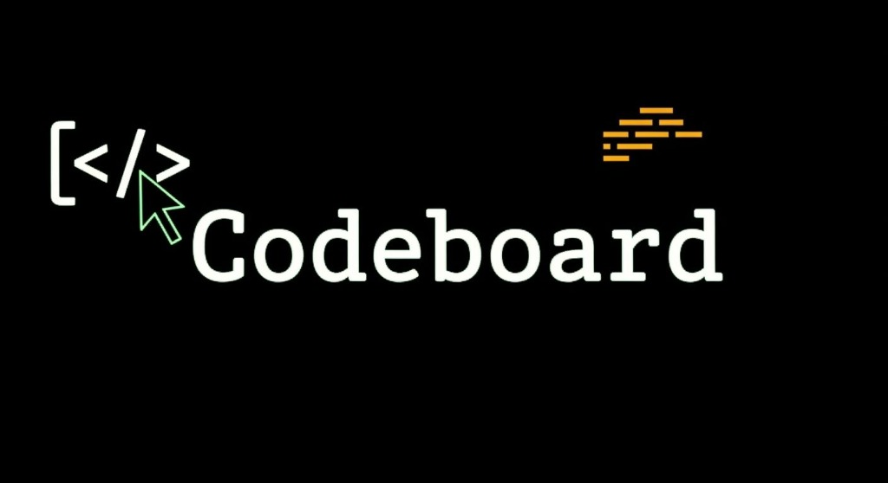

<div align="center">



# CodeBoard

### The Complete Developer Productivity & Analytics Platform 🚀

[](https://nextjs.org/)
[](https://react.dev/)
[](https://www.typescriptlang.org/)
[](https://tailwindcss.com/)
[](https://supabase.com/)
[](https://upstash.com/)

[Features](#-core-features) •
[Architecture](#-system-architecture) •
[Quick Start](#-quick-start) •
[API](#-api-structure) •
[Contributing](#-contributing)

</div>

---

## ⚡ Overview

**CodeBoard** is the ultimate dashboard for competitive programmers and developers. It aggregates your coding journey from platforms like **LeetCode, Codeforces, and GitHub** into a single, beautiful interface.

Designed for students, job seekers, and serious developers, CodeBoard helps you **track progress, analyze performance, and stay consistent** with streaks, leaderboards, and AI-driven insights. It transforms scattered coding stats into a unified professional portfolio.

| Problem | Solution |
| :--- | :--- |
| **Fragmented Data** — Stats scattered across 5+ sites (LC, CF, GitHub). | **Unified Profile** — One dashboard syncing all your coding metrics in real-time. |
| **Lack of Consistency** — Hard to maintain streaks without visualization. | **Activity Heatmaps** — GitHub-style contribution graphs for all your coding platforms. |
| **No Social Proof** — Resumes don't show "daily effort". | **Public Leaderboards** — Compete with friends and showcase your global rank. |
| **Unorganized Prep** — DSA sheets and notes are everywhere. | **Structured Roadmaps** — Built-in DSA sheets (Striver, Love Babbar) with progress tracking. |

---

## 🚀 Core Features

### 📊 Comprehensive Dashboard
The command center of your coding life. View real-time stats, solve streaks, and daily activity graphs.
- **Unified Stats**: Total problems solved across platforms.
- **Activity Graph**: GitHub-style heatmap combining manual and platform activity.
- **Skill Radar**: Visual breakdown of your strengths (DP, Graphs, Arrays).


### 🤖 AI & Analytics
Deep dive into your performance with our custom analytics engine.
- **Growth Trends**: Visualize your problem-solving velocity over time.
- **Weakness Spotlight**: AI identifies topics you're neglecting (e.g., "You haven't solved DP in 2 weeks").
- **Productivity Insights**: "You code best on Tuesday evenings."


### 🏆 Gamification & Leaderboards
Compete with the community.
- **Global Leaderboard**: Live rankings based on problem count and consistency.
- **Podium View**: Top 3 performers highlighted with specialized UI.
- **Streak System**: Don't break the chain.


### 📚 DSA Studio & Sheets
Structured learning paths integrated directly into the platform.
- **Curated Sheets**: Access popular problem lists (Blind 75, NeetCode 150).
- **Notes & Solutions**: Attach markdown notes to every problem you solve.
- **Space Repetition**: Mark problems for review later.


### 💻 Developer Hub
Stay updated with the tech world.
- **Dev News**: Curated tech news feed tailored to your interests.
- **Hackathon Tracker**: Upcoming contests and hackathons.
- **Job Board**: Aggregated internships and full-time roles.


---

## ✨ Feature Highlights

### Landing Page
- Hero section with “ONE DASHBOARD FOR ALL” messaging.
- Metrics chips (developers, problems tracked, uptime).
- “Build. Track. Ship. Faster.” section and live dev activity card.

### Auth (Login / Onboarding)
- Centered login card with Supabase‑backed auth.
- Side panel describing key benefits (profile, sheets, contests, studio).

### Dashboard Overview
- Welcome header with user name.
- Key metrics: problems solved, streak, weekly hours, global rank.
- Contest stats, activity chart, contribution graph, platform/skill panels.

### Dev Hub
- Gradient header with “ONE DASHBOARD FOR ALL”.
- GitHub‑centric stats: repos, commits, languages, deployments.
- Pinned projects and activity summary.

### Leaderboard
- Podium view for top performers.
- Global ranking table with avatars, handles, and scores.
- Metric filters (total questions, score, rating).

### DSA Sheets (Explore & My Sheets)
- Explore curated/public DSA sheets and topic tracks.
- My Sheets view for personal/followed sheets with progress.

### Contests & Event Calendar
- Contest list or calendar with platforms, dates, and statuses.
- Designed to plan Codeforces/other contests alongside streaks.

### Community / Social
- Social feed layout for sharing progress and contest results.
- Space for community discussions and updates.

### Analytics & Profile
- Charts for problem distribution, trends, and platform breakdowns.
- Per‑user profile summary (solved counts, ratings, contributions).

### Settings
- Settings sidebar with sections such as Profile, Platforms, Notifications, Appearance.
- Main content panel for updating preferences and connections.

### Studio / IDE
- Minimal IDE layout within the dashboard.
- Area for solving problems and, in future, AI‑assisted coding.

---

## ⚙️ Tech Stack

Built with a modern, type-safe stack for performance and scalability.

| Layer | Technology | Key Features |
| :--- | :--- | :--- |
| **Frontend** | **Next.js 15 (App Router)** | Server Components, Streaming, SEO optimization. |
| **Styling** | **Tailwind CSS 4** | Zero-runtime styles, dark mode native. |
| **UI Components** | **Radix UI / Lucide** | Accessible primitives, beautiful icons. |
| **Animations** | **Framer Motion** | Smooth layout transitions and micro-interactions. |
| **Backend** | **Next.js API Routes** | Edge-ready serverless functions. |
| **Database** | **Supabase (PostgreSQL)** | Row Level Security (RLS), Realtime subscriptions. |
| **Auth** | **Supabase Auth** | OAuth (GitHub, Google) + Magic Links. |
| **Caching** | **Upstash Redis** | Rate limiting, leaderboard caching, session store. |
| **Validation** | **Zod** | Runtime schema validation for diverse APIs. |

---

## 🏗 System Architecture

CodeBoard follows a modern **Serverless** architecture leveraging the T3 Stack principles.

```mermaid
graph TD
    User[Clients (Web/Mobile)] -->|HTTPS| Edge[Next.js Edge Middleware]
    Edge -->|Auth Guard| App[Next.js App Router]
    
    subgraph Data Layer
        App -->|ORM| DB[(Supabase Postgres)]
        App -->|Cache/Rate Limit| Redis[(Upstash Redis)]
        App -->|Asset Storage| Storage[Supabase Storage]
    end
    
    subgraph External Integrations
        App -->|Fetch Stats| LC[LeetCode GraphQL]
        App -->|Fetch Stats| CF[Codeforces API]
        App -->|Fetch Repos| GH[GitHub API]
    end
    
    subgraph AI Engine
        App -->|Analysis| Insight[Analytics Service]
    end
```

**Data Flow:**
1.  **Auth**: Middleware validates JWTs via Supabase Auth before rendering protected routes (`/dashboard/*`).
2.  **Verification**: Next.js Server Actions fetch and aggregate user data from 3rd party APIs (LeetCode/GitHub).
3.  **Caching**: High-traffic data (Leaderboards) is cached in Redis (60s TTL) to prevent API rate limits.
4.  **Realtime**: Postgres triggers update user stats instantly when they complete a goal.

---

## 🛠 Quick Start

1.  **Clone the repository**
    ```bash
    git clone https://github.com/yourusername/codeboard.git
    cd codeboard
    ```

2.  **Install dependencies**
    ```bash
    npm install
    ```

3.  **Configure Environment**
    Create a `.env.local` file in the root:
    ```env
    NEXT_PUBLIC_SUPABASE_URL=your_supabase_url
    NEXT_PUBLIC_SUPABASE_ANON_KEY=your_supabase_key
    UPSTASH_REDIS_REST_URL=your_redis_url
    UPSTASH_REDIS_REST_TOKEN=your_redis_token
    ```

4.  **Run Development Server**
    ```bash
    npm run dev
    ```
    Visit `http://localhost:3000` to see the app live.

---

## 📂 Project Structure

```bash
codeboard/
├── app/                  # Next.js App Router
│   ├── (auth)/login/     # Auth Pages
│   ├── dashboard/        # Protected Application Routes
│   │   ├── analytics/    # Growth & Insights
│   │   ├── leaderboard/  # Global Rankings
│   │   └── settings/     # User Preferences
│   └── api/              # Serverless API Endpoints
├── components/           # React Components
│   ├── ui/               # Reusable UI Atoms (Button, Input)
│   ├── dashboard/        # Dashboard-specific Code
│   └── icons/            # Custom SVGs
├── lib/                  # Utilities
│   ├── supabase/         # DB Clients
│   └── actions.ts        # Server Actions
└── public/               # Static Assets
```

---

## 🚀 Deployment

CodeBoard is optimized for deployment on **Vercel**.

1.  Push your code to GitHub.
2.  Import the project in Vercel.
3.  Add the Environment Variables from your `.env.local`.
4.  Deploy! Vercel handles the build, edge caching, and asset optimization automatically.

---

## 🤝 Contributing

We welcome contributions! Please see our [Contributing Guide](CONTRIBUTING.md) for details.

1.  Fork the Project
2.  Create your Feature Branch (`git checkout -b feature/AmazingFeature`)
3.  Commit your Changes (`git commit -m 'Add some AmazingFeature'`)
4.  Push to the Branch (`git push origin feature/AmazingFeature`)
5.  Open a Pull Request

---

## 📝 License

Distributed under the MIT License. See `LICENSE` for more information.

---

<div align="center">
  <p>Built with ❤️ by Developers, for Developers.</p>
</div>
